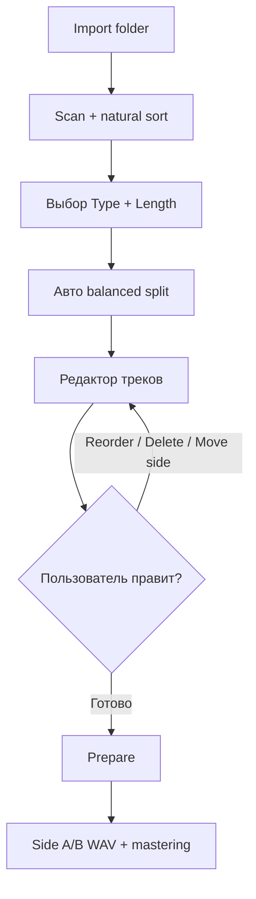

# Техническое задание: UI/UX редактора треков при Import Folder

**Проект:** CassetteMaster / CassetteBurner  
**Версия документа:** 1.0  
**Дата:** 12 июня 2026  
**Автор:** Denis Popkov  
**Статус:** Draft для согласования  

**Референс-макет:** `CASSETTEBURNER` — светлый ретро-интерфейс с таймлайном Side A / Side B, списком проектов и панелью Tape Parameters.

---

## Содержание

1. [Резюме и контекст](#1-резюме-и-контекст)
2. [Цели и границы](#2-цели-и-границы)
3. [Текущее состояние продукта](#3-текущее-состояние-продукта)
4. [Пользователи и сценарии](#4-пользователи-и-сценарии)
5. [Дизайн-система и ключевые цвета](#5-дизайн-система-и-ключевые-цвета)
6. [Информационная архитектура экрана](#6-информационная-архитектура-экрана)
7. [Сценарий Import Folder](#7-сценарий-import-folder)
8. [Редактор треков: два режима представления](#8-редактор-треков-два-режима-представления)
9. [Drag-and-drop: требования](#9-drag-and-drop-требования)
10. [Удаление треков](#10-удаление-треков)
11. [Изменение порядка треков](#11-изменение-порядка-треков)
12. [Перемещение между Side A и Side B](#12-перемещение-между-side-a-и-side-b)
13. [Валидация вместимости и обратная связь](#13-валидация-вместимости-и-обратная-связь)
14. [Состояния интерфейса и edge cases](#14-состояния-интерфейса-и-edge-cases)
15. [Доступность и клавиатура](#15-доступность-и-клавиатура)
16. [Анимации и микровзаимодействия](#16-анимации-и-микровзаимодействия)
17. [Интеграция с существующим кодом](#17-интеграция-с-существующим-кодом)
18. [Нефункциональные требования](#18-нефункциональные-требования)
19. [Поэтапная реализация](#19-поэтапная-реализация)
20. [Критерии приёмки](#20-критерии-приёмки)
21. [Приложения](#21-приложения)

---

## 1. Резюме и контекст

CassetteMaster сегодня умеет импортировать **папку с альбомом**, автоматически рассчитывать разбивку на стороны кассеты (C60 / C90 / C120 / Custom) и запускать офлайн-премастеринг. Пользователь **не может** после импорта:

- увидеть треки в виде редактируемого списка или таймлайна;
- изменить порядок композиций перед записью;
- удалить лишние файлы (бонус-треки, дубликаты, hidden tracks);
- перетащить трек с Side A на Side B вручную;
- тонко подстроить разбивку, если автоматический баланс не совпадает с замыслом микстейпа.

Параллельно существует приложение **CassetteBurner** с визуальным таймлайном Side A / Side B, drag клипов по времени и file-drop, но **без** импорта папки и **без** связи с `FolderMixBuilder`.

**Задача данного ТЗ** — описать целевой UI/UX состояния «после Import Folder», в котором треки можно **красиво** переупорядочивать и удалять через drag-and-drop, с опорой на фирменную палитру CassetteMaster и визуальный язык макета CassetteBurner.

Документ **не** описывает DSP-цепочку премастеринга (см. статьи на Habr и `CassetteAutoMaster`). Фокус — **редактура плейлиста и раскладка по сторонам кассеты** до нажатия Prepare / Render.

---

## 2. Цели и границы

### 2.1. Цели

| # | Цель | Измеримый результат |
|---|------|---------------------|
| G1 | Дать пользователю **контроль над порядком** треков после импорта папки | 100% треков можно переставить за ≤ 3 действия |
| G2 | Позволить **удалять** ненужные файлы без выхода из приложения | Удаление с undo ≤ 1 с восстановлением |
| G3 | Визуализировать **Side A / Side B** в духе макета CassetteBurner | Длительности, overflow, gap 2 s видны до Prepare |
| G4 | Сохранить **автоматическую разбивку** как стартовую точку, не как догму | Кнопка «Rebalance» возвращает алгоритмический split |
| G5 | Единая **цветовая система** на базе `ui::Theme` | Все новые компоненты используют токены, не хардкод |

### 2.2. Вне scope (v1)

- Многокассетный редактор (Cassette 2, 3…) с отдельными вкладками — только **первая кассета** в v1, мульти-кассета в v1.1.
- Редактирование in/out точек внутри трека (trim).
- Нормализация громкости per-track в UI.
- Синхронизация с облаком / коллаборация.
- Импорт плейлистов M3U / Spotify.

### 2.3. Предположения

- Источник — локальная папка; поддерживаемые форматы: WAV, FLAC, AIFF, OGG (`AudioFileLoader`).
- Между треками на стороне сохраняется **gap 2 s** (`FolderScanResult::gapBetweenTracksSec`), настраиваемый в v1.1.
- Длина стороны задаётся в `TapeSetupPanel` (C60 / C90 / C120 / Custom).
- Профиль ленты и деки — как в CassetteMaster (Kenwood KX-1100G, Type I/II/IV).

---

## 3. Текущее состояние продукта

### 3.1. CassetteMaster (`MainComponent`)

**Что уже работает:**

| Возможность | Реализация | Файлы |
|-------------|------------|-------|
| Import folder (кнопка + drag-drop) | `scanMixFolder`, natural sort имён | `MainComponent.cpp`, `FolderMixBuilder.cpp` |
| Выбор типа ленты | Segment buttons Type I / II / IV | `TapeSetupPanel.cpp` |
| Выбор длины кассеты | C60 / C90 / C120 / Custom + slider | `TapeSetupPanel.cpp` |
| Авто-разбивка Side A/B | Balanced split (`findBalancedSplitIndex`) | `FolderMixBuilder.cpp` |
| Отчёт о вместимости | Зелёная строка + status bar | `TapeSetupPanel::tapeFitLabel` |
| Prepare → WAV Side A/B | `startFolderMixBuild`, `SideRenderer` | `MainComponent.cpp` |
| Before/After waveform | `CompareWaveformDisplay` | Только после Prepare |
| Сброс при смене длины ленты | `invalidatePreparedOutput` | `MainComponent.cpp` |

**Чего нет:**

- Списка треков в UI после сканирования.
- Ручного reorder / delete.
- Перехода в режим таймлайна CassetteBurner.
- Undo/redo для редактуры плейлиста.

### 3.2. CassetteBurner (`CassetteBurnerComponent`)

**Что уже работает:**

| Возможность | Реализация | Ограничения |
|-------------|------------|-------------|
| Таймлайн Side A + Side B | `TapeTimelineView` | `maxDurationSec` захардкожен 45:00 |
| 5 параллельных lane | `trackIndex` 1–5 | Не sequential mixtape layout |
| File drop на таймлайн | WAV/FLAC/AIFF | Один файл, не папка |
| Drag клипа по времени | Horizontal reposition | Без cross-side |
| Delete клипа | Double-click | Нет trash zone, нет keyboard |
| Сохранение проекта | `.cassetteproj` JSON | `MixtapeProject::saveToFile` |
| Цвета клипов | 5 hardcoded hex | Не `ui::Theme::trackBlue` и т.д. |

**Чего нет:**

- `FolderMixBuilder::scanFolder` в Burner.
- Import folder в sidebar (только single-file chooser).
- Список проектов не связан с диском (заглушки в UI).
- Светлая тема макета — сейчас тёмный `CassetteBurnerLook`.

### 3.3. Общая модель данных

```
FolderScanResult          MixtapeProject
├── tracks[]              ├── sideA: TapeSide
│   ├── file              │   ├── clips[]: TapeClip
│   ├── displayName       │   └── maxDurationSec
│   └── durationSec       ├── sideB: TapeSide
└── gapBetweenTracksSec   ├── profile, mastering
                          └── name
```

**Мост:** `FolderMixBuilder::buildCassetteProject()` уже строит `MixtapeProject` из `FolderScanResult` + `CassettePlan`, но CassetteMaster **не отображает** этот проект — сразу рендерит WAV.

### 3.4. Gap analysis (макет vs код)

| Элемент макета | CassetteMaster | CassetteBurner |
|----------------|----------------|----------------|
| Светлый beige фон | ✅ `ui::Theme` | ❌ тёмный |
| Import folder | ✅ | ❌ |
| Таймлайн Side A/B | ❌ | ✅ (другая модель lane) |
| `[n] Title (dur)` на клипе | ❌ | Частично (filename) |
| Tooltip format/path/gain | ❌ | ❌ |
| Drag reorder | ❌ | ❌ |
| Delete с affordance | ❌ | double-click only |
| Orange selection pill | ✅ segment buttons | accent `#ff6b35` |
| C60/C90/C120/Custom | ✅ | ❌ |

---

## 4. Пользователи и сценарии

### 4.1. Персоны

**P1 — Домашний микстейп-мейкер**  
Записывает 1–2 кассеты в месяц. Импортирует папку альбома, хочет убрать бонус-трек и поменять порядок A/B перед Prepare.

**P2 — Опытный кассетник**  
Знает длительность C60/C46. Импортирует подборку из 30 треков, вручную балансирует стороны, сверяется с зелёной строкой fit report.

**P3 — Пользователь CassetteBurner**  
Привык к таймлайну. Ожидает тот же редактор после folder import, а не только wizard CassetteMaster.

### 4.2. Ключевые сценарии (User Stories)

| ID | Как… | Хочу… | Чтобы… |
|----|------|-------|--------|
| US-01 | пользователь | перетащить папку в окно | треки появились в редакторе с авто-split |
| US-02 | пользователь | перетащить трек #7 выше #6 | изменить порядок альбома на кассете |
| US-03 | пользователь | удалить трек свайпом/кнопкой | не записывать скрытый бонус на ленту |
| US-04 | пользователь | перетащить трек с Side A на Side B | вручную сбалансировать стороны |
| US-05 | пользователь | видеть красную метку OVERFLOW | понять, что сторона переполнена до Prepare |
| US-06 | пользователь | нажать Undo | отменить случайное удаление |
| US-07 | пользователь | сменить C90 → C60 | увидеть новый split и переполнение |
| US-08 | пользователь | нажать Rebalance | вернуть алгоритмическую разбивку |

### 4.3. Happy path (целевой)



---

## 5. Дизайн-система и ключевые цвета

### 5.1. Базовые токены (`ui::Theme`)

Использовать **только** эти значения в новом UI (не дублировать hex в компонентах).

#### Поверхности

| Токен | HEX | Применение |
|-------|-----|------------|
| `background()` | `#F5F0E6` | Фон окна, canvas |
| `panel()` | `#FAF7F0` | Панели Side A/B, sidebar |
| `card()` | `#FFFFFF` | Карточки треков, text box |
| `sidebarHighlight()` | `#EBE4D8` | Hover строки, неактивный slider track |

#### Акцент и действия

| Токен | HEX | Применение |
|-------|-----|------------|
| `accent()` | `#E85500` | Primary CTA: Prepare, выбранный segment, playhead, drag ghost border |
| `accentMuted()` | `#FF7A33` | Hover на accent-кнопках, лёгкий glow при drag |
| `prepare()` | = accent | Кнопка Prepare |

#### Семантика

| Токен | HEX | Применение |
|-------|-----|------------|
| `okGreen()` | `#3D8B5F` | Fit OK, строка плана, Side в пределах лимита |
| `warnAmber()` | `#C45C00` | Near-capacity (>90% стороны), предупреждения |
| `failRed()` | `#C0392B` | Overflow, трек длиннее стороны, invalid drop |
| `exportGreen()` | `#2D6A4F` | Export WAV (вторичный success) |

#### Текст

| Токен | HEX | Применение |
|-------|-----|------------|
| `textPrimary()` | `#111111` | Заголовки, номера треков, duration |
| `textSecondary()` | `#444444` | Artist, path в tooltip |
| `textMuted()` | `#666666` | Placeholder, ruler labels |

#### Границы

| Токен | HEX | Применение |
|-------|-----|------------|
| `border()` | `#111111` | Обводка выбранного трека, segment active |
| `borderLight()` | `#CCCCCC` | Обводка карточек, input fields |

#### Цвета треков (семантические, не decorative)

| Токен | HEX | Назначение в редакторе |
|-------|-----|------------------------|
| `trackBlue()` | `#4A90D9` | Обычный музыкальный трек |
| `trackGreen()` | `#5CB88A` | Трек на «противоположной» стороне после ручного move (визуальный hint) |
| `trackGrey()` | `#9AA0A6` | Disabled / удалённый ghost при drag, gap marker |

> **Правило:** не использовать старую палитру `TapeTimelineView` (`#3b82f6`, `#22c55e`…) в новом редакторе — мигрировать на `trackBlue/Green/Grey`.

### 5.2. Типографика

| Стиль | Шрифт (macOS) | Размер | Использование |
|-------|---------------|--------|---------------|
| `sectionFont()` | SF Pro Bold | 11.5 pt | «SIDE A», «Cassette length» |
| `bodyFont()` | SF Pro | 13 pt | Названия треков, кнопки |
| `captionFont()` | SF Pro | 11 pt | Длительность, fit report |
| `metricFont()` | SF Mono | 12 pt | Время `4:12`, slider min, ruler |

### 5.3. Радиусы и отступы

| Константа | Значение | Где |
|-----------|----------|-----|
| `kCardRadius` | 0 px | Стиль макета — прямоугольники, 1 px border |
| `kTrackRowH` | 36 px | Строка в list mode |
| `kClipH` | 28 px | Высота клипа в timeline mode |
| `kGap` | 4 px | Между segment buttons |
| `kSectionPad` | 12–14 px | Как в `TapeSetupPanel` |

### 5.4. Иконография (v1 — unicode / SF Symbols)

| Действие | Иконка | Подпись |
|----------|--------|---------|
| Drag handle | `≡` (grip) | 6 точек слева от названия |
| Delete | `×` | Появляется on hover справа |
| Overflow | `!` в badge | Красный фон `failRed()` |
| Side A | `A` | В заголовке панели |
| Side B | `B` | В заголовке панели |

---

## 6. Информационная архитектура экрана

### 6.1. Режим «Mixtape Editor» (новый, после import folder)

Целевая компоновка объединяет CassetteMaster wizard и макет CassetteBurner:

```
┌─────────────────────────────────────────────────────────────────────────┐
│ [Before][After]  [Prepare]                    [Export WAV]              │
├──────────┬──────────────────────────────────────────────┬───────────────┤
│ Sidebar  │  Wizard strip: Add ✓ → Edit ● → Export ○    │ Tape Params   │
│ 208 px   ├──────────────────────────────────────────────┤ 260 px        │
│          │  Tape type + Cassette length (как сейчас)    │ Type I/II/IV  │
│ New      │  Fit report (зелёная строка)                │ Bias / Level  │
│ Import   ├──────────────────────────────────────────────┤               │
│          │  ┌─ SIDE A (45:00) ─────────────────────────┐ │               │
│ Session  │  │ [≡] 1  Track …………………… 4:12        [×]  │ │               │
│ label    │  │ [≡] 2  Track …………………… 3:58        [×]  │ │               │
│          │  └──────────────────────────────────────────┘ │               │
│          │  ┌─ SIDE B (45:00) ─────────────────────────┐ │               │
│          │  │ [≡] 3  Track …………………… 5:01        [×]  │ │               │
│          │  └──────────────────────────────────────────┘ │               │
│          │  [List ⟷ Timeline]  [Rebalance]  [+ Add file]  │               │
├──────────┴──────────────────────────────────────────────┴───────────────┤
│ Status: 20 tracks, 70:07 — Side A: 10 (35:10) | Side B: 10 (34:57)     │
└─────────────────────────────────────────────────────────────────────────┘
```

### 6.2. Переключатель List / Timeline

| Режим | Когда по умолчанию | Аудитория |
|-------|-------------------|-----------|
| **List** | После import folder | Reorder, delete — основной сценарий P1 |
| **Timeline** | По кнопке / для P3 | Визуальная длительность, fine-tune (v1.1) |

В **v1** приоритет — **List mode** с drag reorder. Timeline mode наследует `TapeTimelineView`, но переводится на sequential single-lane layout (один трек за другим, как на кассете).

### 6.3. Зоны drop

| Зона | Принимает | Визуал при hover |
|------|-----------|------------------|
| Вся центральная панель | Папку, аудиофайлы | `accent()` border 2 px, `accent().withAlpha(0.08)` fill |
| Строка Side A | Трек из Side B, reorder | Линия-индикатор 2 px `accent()` между строками |
| Строка Side B | Трек из Side A | То же |
| Trash (нижняя зона) | Удаляемый трек | `failRed()` fill 15% при hover |

---

## 7. Сценарий Import Folder

### 7.1. Триггеры

1. Кнопка **Import audio** (уже открывает folder chooser).
2. Drag-and-drop папки на `DropHeroPanel` / центр / sidebar.
3. (Burner) Кнопка **Import folder** в `ProjectSidebar` — **новая**, отдельно от single-file.

### 7.2. Pipeline после выбора папки

```
1. FolderMixBuilder::scanFolder(folder)
2. Показать progress в status: «Scanning … (N files)»
3. TapeSetupPanel::setMixtapeMode(true)
4. refreshFolderFitLabel() — как сейчас
5. НОВОЕ: build editable MixtapeProject из FolderScanResult + текущий CassettePlan
6. НОВОЕ: TrackListEditor::setProject(project)
7. Wizard phase → Edit (новая фаза между Add и Prepare)
```

### 7.3. Сортировка по умолчанию

- Natural sort имён файлов (как сейчас) — **не менять** без явного действия пользователя.
- В UI показать hint: «Sorted by filename — drag to reorder».

### 7.4. Мульти-кассетные альбомы

Если `FolderFitReport.cassetteCount > 1`:

- v1: показать **banner** `warnAmber`: «Album needs 2 cassettes — editing Cassette 1 only».
- Dropdown выбора кассеты — v1.1.

---

## 8. Редактор треков: два режима представления

### 8.1. List Mode (приоритет v1)

**Строка трека** содержит:

| Элемент | Ширина | Описание |
|---------|--------|----------|
| Drag handle | 24 px | `≡`, cursor grab |
| Index | 32 px | `[n]` mono, обновляется при reorder |
| Title | flex | `displayName` без расширения |
| Duration | 56 px | `M:SS` mono right-aligned |
| Delete | 28 px | `×`, opacity 0 → 1 on row hover |

**Фон строки:**

- Default: `card()` на `panel()`.
- Hover: `sidebarHighlight()`.
- Selected: border 1 px `border()`, фон `card()`.
- Dragging: полупрозрачный ghost `accentMuted()` border 2 px.
- Drop target: горизонтальная линия `accent()` 2 px между строками.

### 8.2. Timeline Mode (v1 — read-only preview, v1.1 — edit)

Sequential layout (не 5 lane):

- Один ряд клипов на сторону, `startTimeSec` пересчитывается при reorder в list mode.
- Ruler: шаг 5 min до 45 min, 10 min для C90+.
- Клип: высота 28 px, цвет `trackBlue()`, текст `[n] Title (dur)`.
- Playhead: вертикальная линия 1 px `accent()`.
- Overflow: badge `failRed()` «OVERFLOW» на клипе, выходящем за `maxDurationSec`.

### 8.3. Связь режимов

Любое изменение в List **немедленно** пересчитывает `TapeClip.startTimeSec` для Timeline и fit report. Единый source of truth — `MixtapeProject`.

---

## 9. Drag-and-drop: требования

### 9.1. Типы drag операций

| ID | Источник | Цель | Действие |
|----|----------|------|----------|
| D1 | Handle строки Side A | Другая позиция Side A | Reorder на стороне |
| D2 | Handle строки Side B | Другая позиция Side B | Reorder на стороне |
| D3 | Строка Side A | Side B | Move между сторонами + insert |
| D4 | Строка Side B | Side A | Move между сторонами |
| D5 | Файл с ОС | Side A / B | Добавить трек в конец стороны |
| D6 | Строка | Trash zone | Delete (альтернатива ×) |

### 9.2. Визуальный feedback (обязательный)

**При начале drag (pointer down на handle + move > 4 px):**

- Курсор: `draggingHand` / closed hand.
- Исходная строка: opacity 40%.
- Ghost: копия строки под курсором, тень 0 2 8 `border().withAlpha(0.15)`, border `accent()` 2 px.

**При hover над valid drop:**

- Insertion line между строками (не подсвечивать всю строку целиком оранжевым — пользователь просил убрать «полуоранжевое» выделение).
- Целевая Side panel: border-left 3 px `accent()` если cross-side.

**При invalid drop (overflow):**

- Курсор `notAllowed`.
- Панель стороны: лёгкий tint `failRed().withAlpha(0.06)`.
- Tooltip: «Side B would be 46:12 — limit 45:00».

### 9.3. Логика вставки

- Drop **между** строками i и i+1 вставляет на позицию i+1.
- Drop **в пустую** Side (0 треков) — единственная строка.
- После insert: пересчитать `startTimeSec` всех клипов стороны:  
  `cursor = 0; for each clip: clip.startTimeSec = cursor; cursor += clip.duration + gap`.

### 9.4. Ограничения

- Нельзя drop трек, если **один** файл длиннее `maxDurationSec` — показать modal (как сейчас `fits == false`).
- Можно drop с overflow **на сторону**, но Prepare блокируется до устранения; строка fit report → `failRed()`.

### 9.5. Жесты (macOS)

| Жест | Действие |
|------|----------|
| Click + drag handle | D1–D4 |
| Option + drag | Копия трека на другую сторону (v1.1) |
| Drag за пределы списка вниз | Появление Trash zone (200 ms delay) |

---

## 10. Удаление треков

### 10.1. Способы удаления

| Способ | Приоритет v1 | Подтверждение |
|--------|--------------|---------------|
| Кнопка `×` on hover | ✅ | Нет (undo вместо confirm) |
| Drag в Trash zone | ✅ | Нет |
| Delete / Backspace на selected row | ✅ | Нет |
| Double-click | ❌ убрать в list mode | — |

### 10.2. Поведение после удаления

1. Убрать `FolderTrackInfo` из редактируемого списка (не удалять файл с диска).
2. Перенумеровать индексы `[n]`.
3. Пересчитать split durations и fit report.
4. Push action в undo stack.

### 10.3. Trash zone

- Появляется внизу центральной панели при активном drag (высота 48 px).
- Иконка `×` + текст «Drop to remove» `textSecondary()`.
- Idle: скрыта. Active drag: slide-up 150 ms ease-out.
- Hover с треком: фон `failRed().withAlpha(0.12)`, border `failRed()`.

### 10.4. Undo / Redo

| Комбинация | Действие |
|------------|----------|
| ⌘Z | Undo последнее edit-действие |
| ⌘⇧Z | Redo |

Стек: reorder, delete, move side, add file (max 50 шагов).

---

## 11. Изменение порядка треков

### 11.1. Reorder внутри стороны

- Меняется только порядок в `vector<TapeClip>` / порядок `FolderTrackInfo` для соответствующего диапазона.
- Gap 2 s между **всеми** соседними треками на стороне сохраняется.
- **Не** менять порядок на другой стороне автоматически.

### 11.2. Кнопка «Rebalance»

- Расположение: под списками, слева от «+ Add file».
- Стиль: `styleNeutralButton`.
- Действие: вызов `FolderMixBuilder::analyzeFit` + применение `CassettePlan` к текущему списку треков (после удалений пользователя).
- Подтверждение, если есть несохранённые ручные правки: «Replace your track layout with automatic split?»

### 11.3. Keyboard reorder

| Клавиша | Действие |
|---------|----------|
| ⌥↑ | Переместить selected row вверх |
| ⌥↓ | Переместить selected row вниз |

---

## 12. Перемещение между Side A и Side B

### 12.1. Правила

- Трек **удаляется** из исходной стороны и **вставляется** в целевую на позицию drop.
- Цвет строки первые 2 с после move: `trackGreen()` border-left 3 px — hint «перемещён вручную».
- Fit report обновляется live.

### 12.2. Альтернатива: контекстное меню

- Right-click → «Move to Side B» / «Move to Side A».
- Disabled, если сторона-цель не может вместить даже пустую вставку (single track too long).

---

## 13. Валидация вместимости и обратная связь

### 13.1. Индикаторы на заголовке стороны

```
SIDE A (35:10 / 45:00)  ████████░░  78%   okGreen
SIDE B (46:12 / 45:00)  ██████████  103%  failRed + OVERFLOW
```

- Progress bar: высота 4 px под заголовком.
- Fill `okGreen()` до 90%, `warnAmber()` 90–100%, `failRed()` > 100%.

### 13.2. Строка fit report

Формат (как сейчас, расширить):

```
20 tracks, 70:07 — Side A: 10 (35:10) | Side B: 10 (34:57) / 45:00 per side
```

При Custom:

```
… / Custom (36 min), 36:00 per side
```

### 13.3. Блокировка Prepare

| Условие | Prepare |
|---------|---------|
| Любая сторона overflow | Disabled |
| Трек длиннее стороны | Disabled |
| Пустая Side A | Disabled |
| Side B пустая, всё на A | **Enabled** (валидный сценарий) |
| Идёт drag | Disabled |

Tooltip на disabled Prepare: причина одной строкой.

---

## 14. Состояния интерфейса и edge cases

### 14.1. Матрица состояний

| Состояние | UI |
|-----------|-----|
| Empty | DropHero «Drop folder or file» |
| Scanning | Progress в status, список disabled |
| Editing | Полный редактор, Prepare enabled/disabled по fit |
| Preparing | Progress bar %, список read-only |
| Ready | Waveform Before/After, Export enabled |
| Error scan | `failRed` status, retry Import |

### 14.2. Edge cases

| Case | Поведение |
|------|-----------|
| 1 трек, 80 min, C60 | Fit false, список показан, Prepare disabled, hint «Use longer side or Custom» |
| Пустая папка | Error до редактора |
| Дубликаты имён | Показать оба, warning в status |
| Файл удалён с диска после import | Строка `failRed` strikethrough, Prepare blocked |
| Смена Type/Length при правках | Rebalance предложен, не silent overwrite |
| 100+ треков | Virtualized list (ListBox), drag остаётся |

---

## 15. Доступность и клавиатура

- Focus ring: 2 px `accent()` offset 2 px на selected row (не selection highlight в text field).
- VoiceOver: «Track 3, Sunshine, 4 minutes 12 seconds, Side A, draggable».
- Все действия delete/reorder доступны с клавиатуры без drag.
- Contrast ratio текста на `card()` ≥ 4.5:1 (`textPrimary` на белом — OK).

---

## 16. Анимации и микровзаимодействия

| Анимация | Длительность | Easing |
|----------|--------------|--------|
| Row reorder (соседи сдвигаются) | 120 ms | ease-out |
| Trash zone appear | 150 ms | ease-out |
| Insertion line fade in | 80 ms | linear |
| Progress bar capacity | 200 ms | ease-out при изменении % |
| Нет bounce / spring | — | Профессиональный тон |

**Запрещено:** полупрозрачное оранжевое выделение текста в полях ввода (как в Custom slider) — `textBoxHighlightColourId = card()`.

---

## 17. Интеграция с существующим кодом

### 17.1. Новые компоненты (предлагаемые)

| Компонент | Ответственность |
|-----------|-----------------|
| `TrackListEditor` | List mode, drag, delete, две колонки Side A/B |
| `TrackRowComponent` | Одна строка трека |
| `TrashDropZone` | Drop to delete |
| `SideCapacityHeader` | Заголовок + progress bar |
| `MixtapeEditController` | Мутации проекта, undo, rebalance |

### 17.2. Изменения в существующих файлах

| Файл | Изменение |
|------|-----------|
| `MainComponent.cpp` | После `scanMixFolder` → populate editor; новая wizard phase Edit |
| `WizardStepStrip` | Фаза `Editing` между Add и Prepare |
| `FolderMixBuilder.cpp` | `applyPlanToTrackOrder`, `projectFromScan` |
| `MixtapeProject` | Методы `removeClip`, `moveClip`, `reorder` |
| `TapeTimelineView.cpp` | Опционально: sequential mode, `ui::Theme` colors |
| `CassetteBurnerComponent.cpp` | Import folder → тот же `TrackListEditor` |

### 17.3. API контроллера (черновик)

```cpp
class MixtapeEditController {
public:
    void loadFromFolderScan(const FolderScanResult&, const FolderFitReport&);
    bool moveTrack(int fromSide, int fromIndex, int toSide, int toIndex);
    bool deleteTrack(int side, int index);
    void rebalanceFromAlgorithm();
    bool canPrepare() const;
    MixtapeProject& project();
    UndoManager& undo();
};
```

### 17.4. Сохранение проекта

- Расширить `.cassetteproj`: секция `sourceFolder`, `trackOrder[]`, `manualEdits: true`.
- При reload — восстановить ручной порядок, не перезапускать natural sort.

---

## 18. Нефункциональные требования

| Метрика | Цель |
|---------|------|
| Время открытия редактора после scan 20 треков | < 300 ms |
| FPS при drag | ≥ 60 на M1 |
| Задержка обновления fit report после drop | < 50 ms |
| Память | Не дублировать audio buffers в editor (только metadata) |

---

## 19. Поэтапная реализация

### Phase 1 — List editor в CassetteMaster (MVP)

- `TrackListEditor` list mode only.
- Reorder + delete + undo.
- Live fit report.
- Без Timeline mode.

**Оценка:** 3–4 недели.

### Phase 2 — Cross-side + Trash + keyboard

- Move A ↔ B.
- Trash zone drag.
- ⌘Z, Delete, ⌥↑↓.

**Оценка:** 1–2 недели.

### Phase 3 — Timeline preview + CassetteBurner merge

- Sequential timeline read-only.
- Import folder в Burner.
- Светлая тема Burner = `ui::Theme`.

**Оценка:** 3 недели.

### Phase 4 — Multi-cassette + polish

- Cassette 1/2 selector.
- Tooltips format/path.
- Virtualized list 100+ tracks.

**Оценка:** 2 недели.

---

## 20. Критерии приёмки

### 20.1. MVP (Phase 1)

- [ ] После import folder отображаются все треки в Side A / Side B согласно balanced split.
- [ ] Drag handle меняет порядок внутри стороны; индексы `[n]` обновляются.
- [ ] `×` и Delete удаляют трек; ⌘Z восстанавливает.
- [ ] Fit report обновляется без перезапуска scan.
- [ ] Prepare заблокирован при overflow; разблокирован при valid layout.
- [ ] Все цвета из `ui::Theme` — визуальная проверка дизайн-чеклистом.
- [ ] Нет оранжевого text selection highlight в input полях.

### 20.2. Полный v1 (Phase 1–2)

- [ ] Перетаскивание трека между Side A и Side B.
- [ ] Trash zone при drag.
- [ ] Rebalance с подтверждением сбрасывает к алгоритму.
- [ ] Автотесты: reorder → `startTimeSec` monotonic; delete → fit recalc.

### 20.3. Регрессия CassetteMaster

- [ ] Single-file workflow без изменений.
- [ ] Charli XCX fixture CI проходит.
- [ ] Export Side A/B WAV идентичен порядку в редакторе.

---

## 21. Приложения

### Приложение A. Glossary

| Термин | Определение |
|--------|-------------|
| **Clip** | `TapeClip` — трек на таймлайне с `startTimeSec` |
| **Balanced split** | Алгоритм минимизации \|durA − durB\| при ограничении cap |
| **Fit report** | Строка `FolderFitReport::summary()` |
| **Gap** | 2 s тишины между треками на стороне |
| **Overflow** | Суммарная длительность стороны > `maxDurationSec` + tolerance |

### Приложение B. Референсные файлы кодовой базы

```
Source/ui/MainComponent.cpp          — mixtape wizard
Source/ui/TapeSetupPanel.cpp         — type + length
Source/project/FolderMixBuilder.cpp  — scan + split
Source/project/MixtapeProject.h      — data model
Source/ui/burner/TapeTimelineView.cpp — timeline (Burner)
Source/ui/UiTheme.h                  — design tokens
Source/ui/burner/ProjectSidebar.cpp  — sidebar import
```

### Приложение C. Mockup alignment checklist

- [ ] Light beige `background()` вместо `#1a1a1e`
- [ ] Orange pill selection `accent()` на проекте и Type IV
- [ ] Track colors `trackBlue/Green/Grey` не rainbow palette
- [ ] Monospace durations в ruler и строках
- [ ] Tooltip с format / path / gain (Phase 3)
- [ ] Transport «SIDE A - [2] Title» (Phase 3, Burner)

### Приложение D. Пример данных после редактирования

**До:** 20 tracks, balanced 10|10 @ 45 min  
**Действие:** Удалить track 7, переместить track 20 на Side A  
**После:** 19 tracks, Side A: 11 (38:02), Side B: 8 (31:05) — fit OK  

---

## 22. Детальные wireframes по состояниям

### 22.1. Empty — до импорта

```
┌────────────────────────────────────────────────────────────┐
│ background #F5F0E6                                         │
│                                                            │
│              ┌ ─ ─ ─ ─ ─ ─ ─ ─ ─ ─ ─ ─ ┐                  │
│              │  Drop folder or audio    │  border accent   │
│              │  WAV · FLAC · AIFF · OGG │  on drag hover   │
│              └ ─ ─ ─ ─ ─ ─ ─ ─ ─ ─ ─ ─ ┘                  │
│                                                            │
└────────────────────────────────────────────────────────────┘
```

### 22.2. Editing — hover на строке трека

```
│ SIDE A (35:10 / 45:00) ████████░░                         │
├────────────────────────────────────────────────────────────┤
│ ┌────────────────────────────────────────────────────────┐│
│ │ ≡  [4]  Fortnight feat. Post Malone      4:12     × ││  ← hover: #EBE4D8
│ └────────────────────────────────────────────────────────┘│
│ │ ≡  [5]  The Smallest Man…                3:44     · ││  ← delete hidden
```

- `×` — `textPrimary()`, hit area 28×36 px.
- Drag handle — cursor `grab`; при active `grabbing`.

### 22.3. Active drag — insertion indicator

```
│ ≡  [3]  Track A (ghost 40% opacity)                        │
│ ─────────── accent #E85500 2px ───────────  ← drop here    │
│ ≡  [4]  Track B                                            │
│ ≡  [5]  Track C                                            │
├────────────────────────────────────────────────────────────┤
│  ┌──────────────────────────────────────────────────────┐  │
│  │  ×  Drop to remove                         failRed   │  │  Trash zone
│  └──────────────────────────────────────────────────────┘  │
```

### 22.4. Overflow state

```
│ SIDE B (47:02 / 45:00) ██████████ OVERFLOW                 │  text failRed
├────────────────────────────────────────────────────────────┤
│ ≡  [18]  Bonus Track                       8:12      ×    │  border-left failRed 3px
```

Prepare: disabled, tooltip «Side B is 2:02 over limit».

### 22.5. Custom length + slider (контекст CassetteMaster)

Панель длины остаётся **над** редактором треков. При изменении slider:

1. `maxDurationSec` обновляется на обеих сторонах.
2. Fit report пересчитывается **без** сброса ручного порядка.
3. Если overflow — только warning, порядок не меняется автоматически.

---

## 23. Спецификация компонентов (черновик API)

### 23.1. `TrackListEditor`

```cpp
class TrackListEditor : public juce::Component,
                          public juce::DragAndDropContainer,
                          public juce::FileDragAndDropTarget
{
public:
    std::function<void()> onLayoutChanged;
    std::function<void(const juce::String& status)> onStatusMessage;

    void setProject(MixtapeProject* project);
    void setFitReport(const FolderFitReport& report);
    void setInteractionEnabled(bool enabled);
    void setViewMode(ViewMode mode); // List | Timeline

    bool hasOverflow() const;
};
```

### 23.2. `TrackRowComponent`

| Prop | Тип | Описание |
|------|-----|----------|
| `index` | int | Отображаемый [n] |
| `title` | String | displayName |
| `durationSec` | double | Для label M:SS |
| `sideIndex` | 0 / 1 | A или B |
| `manuallyMoved` | bool | Зелёный accent border |
| `isOverflowContributor` | bool | Красный border если клип за cap |

### 23.3. События `onLayoutChanged`

Вызывается при: reorder, delete, move side, rebalance, add file, change tape length.

Подписчики:

- `MainComponent::refreshFolderFitLabel`
- `MainComponent::updateWizardState`
- `MixtapeEditController::pushUndo`

---

## 24. Тест-кейсы UX (QA)

| ID | Шаги | Ожидание |
|----|------|----------|
| QA-01 | Import папка 13 треков, C60 | Split ~поровну, зелёный fit |
| QA-02 | Drag track 1 ниже track 5 на Side A | Порядок 2-3-4-5-1, индексы обновлены |
| QA-03 | Delete track 3, ⌘Z | Трек восстановлен, fit как до удаления |
| QA-04 | Move track с A на B | Длительности сторон пересчитаны |
| QA-05 | Rebalance после ручных правок | Confirm dialog → алгоритмический split |
| QA-06 | Custom 36 min, slider drag | Status live update, без orange text selection |
| QA-07 | Prepare при overflow | Кнопка disabled, tooltip с причиной |
| QA-08 | Export WAV | Порядок на ленте = порядок в редакторе |
| QA-09 | Drag файла с Desktop на Side B | Файл добавлен в конец B |
| QA-10 | 1 track 80 min, C60 | Editor visible, Prepare blocked |

---

## 25. Сравнение с конкурентами / референсами

| Продукт | Что взять | Что не копировать |
|---------|-----------|-----------------|
| iTunes / Music playlist | Drag handle, clear row height | Метаданные облака |
| Audacity label track | Временная шкала | Сложность multitrack |
| Cassette J-card apps | Side A/B метафора | Только печать, без audio |
| Spotify playlist reorder | Smooth reorder animation | Online-only |

**Уникальность CassetteMaster:** fit report привязан к **физическим** ограничениям кассеты (C60/C90/Custom), не к abstract playlist.

---

## 26. Риски и митигация

| Риск | Вероятность | Митигация |
|------|-------------|-----------|
| Два приложения (Master/Burner) расходятся | Высокая | Общий `MixtapeEditController` в `cassette_core` |
| 5-lane vs sequential layout путает пользователя | Средняя | List mode default; timeline sequential в Phase 3 |
| Performance на 200+ треков | Низкая | VirtualizedListBox в Phase 4 |
| Пользователь ломает split и не понимает overflow | Высокая | Progress bar + Rebalance + tooltip на Prepare |

---

## 27. Открытые вопросы для согласования

1. **Gap 2 s** — показывать ли отдельной серой полоской `trackGrey()` между клипами в timeline?
2. **Удаление** — нужен ли confirm для альбомов > 20 треков?
3. **Burner** — полный merge с CassetteMaster в один binary или shared editor component?
4. **Имена треков** — парсить `Artist - Title` из filename или оставить raw filename?
5. **Multi-cassette** — tab UI или wizard «Cassette 2 of 3»?

---

## 28. Связь с продуктовой линейкой

```
Import → Edit (НОВОЕ) → Prepare (DSP) → Export → (опционально) CassetteBurner fine-tune
```

Редактор треков — **обязательная** ступень для folder workflow, опциональная для single-file (можно skip, как сейчас).

Статья Habr (DSP премастеринг) остаётся валидной для этапа Prepare; данное ТЗ закрывает пробел **до** DSP.

---

## История изменений

| Версия | Дата | Изменения |
|--------|------|-----------|
| 1.0 | 12.06.2026 | Первая версия ТЗ на основе CassetteMaster 2026-06 и макета CassetteBurner |

---

*Документ подготовлен для согласования перед реализацией `TrackListEditor` в CassetteAutoMaster. Комментарии и правки — в issue tracker или PR к `docs/TZ-Folder-Track-Editor-UI.md`.*
